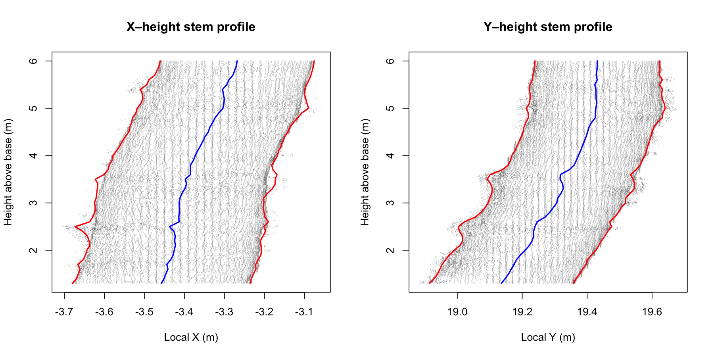

# Open LiDAR Forest Structure

Open-source R workflows for extracting forest structural information from airborne and terrestrial LiDAR point clouds.

## Project overview

This repository contains two connected workflows.

### Airborne LiDAR

The airborne workflow:

- inspects and summarises LAS/LAZ point clouds;
- calculates canopy-height and return-density metrics;
- generates a 1 m canopy height model;
- detects treetops using a local-maximum filter;
- delineates individual crowns;
- derives crown and grid-level structural predictors.

The outputs are structural indicators relevant to biomass modelling. They are not direct biomass estimates because no field-calibrated biomass model is applied.

### Terrestrial LiDAR

The TLS workflow processes already-isolated individual-tree point clouds to estimate:

- total tree height;
- diameter at breast height (DBH);
- basal area;
- stem diameter at successive heights;
- lower-stem taper;
- stem displacement and apparent lean;
- circle-fit and tracking quality indicators.

The current prototype was validated on tree WL12, a *Fagus sylvatica* point cloud containing approximately 1.42 million points.

| TLS measurement | Result |
|---|---:|
| Estimated height | 25.599 m |
| Estimated DBH | 44.339 cm |
| Reference DBH | 43.588 cm |
| DBH error | 0.751 cm |
| Basal area | 0.154 m² |
| Diameter at 6 m | 38.483 cm |
| Lower-stem taper | 1.246 cm m⁻¹ |
| Apparent lower-stem lean | 4.276° |
| Mean absolute taper error | 0.517 cm |

## Current status

- Airborne demonstration workflow: complete
- Single-tree TLS workflow: complete and validated for WL12
- Reusable multi-tree TLS function: under development
- Batch validation across species: planned
- Graphical user interface: planned
- Full QSM reconstruction: possible future extension

The TLS method currently uses successive robust circle fits. Its tracking tolerances and quality thresholds are prototype parameters and must be validated across additional trees before operational use.

## Data

Airborne testing uses the `Megaplot.laz` example supplied with `lidR`.

TLS testing uses:

Bornand, A. (2023). *Individual tree TLS point clouds for tree volume estimation*. EnviDat.  
https://doi.org/10.16904/envidat.403

Large LAS/LAZ files are excluded from GitHub. Downloaded point clouds should be stored under `data/raw/`.

## Key references

- Roussel et al. (2020). `lidR`: An R package for analysis of airborne laser scanning data. https://doi.org/10.1016/j.rse.2020.112061
- Dalponte and Coomes (2016). Tree-centric mapping of forest carbon density. https://doi.org/10.1111/2041-210X.12575
- Liang et al. (2014). Automated stem curve measurement using terrestrial laser scanning. https://doi.org/10.1109/TGRS.2013.2253783
- Terryn et al. (2023). Analysing individual 3D tree structure using the R package ITSMe. https://doi.org/10.1111/2041-210X.14026
- Raumonen et al. (2013). Fast automatic precision tree models from terrestrial laser scanner data. https://doi.org/10.3390/rs5020491

## Licence

MIT Licenseect will address stem reconstruction, DBH and
individual-tree architecture without conflating the two acquisition systems.
