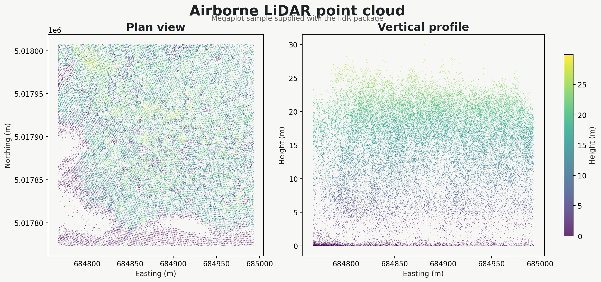

# Open LiDAR Forest Structure

An introductory, reproducible R workflow for extracting forest-structure and
biomass-related indicators from an open airborne LiDAR point cloud.


## What this project does

The workflow uses the `Megaplot.laz` example supplied with the
[`lidR`](https://github.com/r-lidar/lidR) package. It progresses from point-cloud
inspection to canopy modelling, individual-tree detection, crown segmentation
and the calculation of structural predictors that can later support a calibrated
biomass model.

The scripts:

1. inspect the point cloud, classifications and laser returns;
2. calculate site-level and 20 m canopy metrics;
3. construct a 1 m canopy height model (CHM);
4. detect treetops using a local-maximum filter;
5. delineate individual crowns with the Dalponte–Coomes algorithm; and
6. derive height, canopy-density and crown-structure indicators.

## Point cloud

The example contains **81,590 points** and covers approximately **5.16 ha**.
Recorded heights range to **29.97 m**, with a 95th-percentile height of
**23.05 m**.



## Canopy metrics

Canopy metrics were summarised in 20 × 20 m cells. The maps below show how mean
height and the 95th-percentile height vary across the sample area.


## Individual-tree structure

A 5 m local-maximum window identified **558 treetops**. Crown segmentation
produced **535 crown polygons**, with a mean estimated tree height of **22.09 m**
and a mean crown area of **78.85 m²**.


The sensitivity test illustrates why the detection window must be selected
carefully: 3, 5 and 7 m windows detected 791, 558 and 453 treetops,
respectively.

## Biomass-related predictors

The final script calculates structural variables commonly used as predictors in
field-calibrated biomass models. These outputs are **not direct biomass
estimates** because no field biomass observations or fitted allometric model are
included in this introductory dataset.


## Repository structure

```text
data/                  Data instructions; large point clouds are excluded
scripts/               Numbered R workflow
outputs/figures/       README and social-preview figures
outputs/rasters/       Generated raster products (excluded from Git)
outputs/tables/        Site, grid-cell and tree-level measurements
outputs/vectors/       Treetop and crown GeoPackages
```

## Run the workflow

Open `open-lidar-forest-structure.Rproj` in RStudio and run the scripts in
numeric order:

```r
source("scripts/00_setup.R")
source("scripts/01_inspect_point_cloud.R")
source("scripts/02_canopy_metrics.R")
source("scripts/03_detect_treetops.R")
source("scripts/04_segment_tree_crowns.R")
source("scripts/05_biomass_predictors.R")
source("scripts/06_export_figures.R")
```

Large source point clouds and generated rasters are intentionally excluded from
version control. Script `01_inspect_point_cloud.R` copies the example LAZ file
from the locally installed `lidR` package.

## Software

- R
- `lidR`
- `terra`
- `sf`
- `data.table`
- `ggplot2`

## Scope

This repository documents an introductory **airborne LiDAR** workflow. A
separate terrestrial LiDAR project will address stem reconstruction, DBH and
individual-tree architecture without conflating the two acquisition systems.
