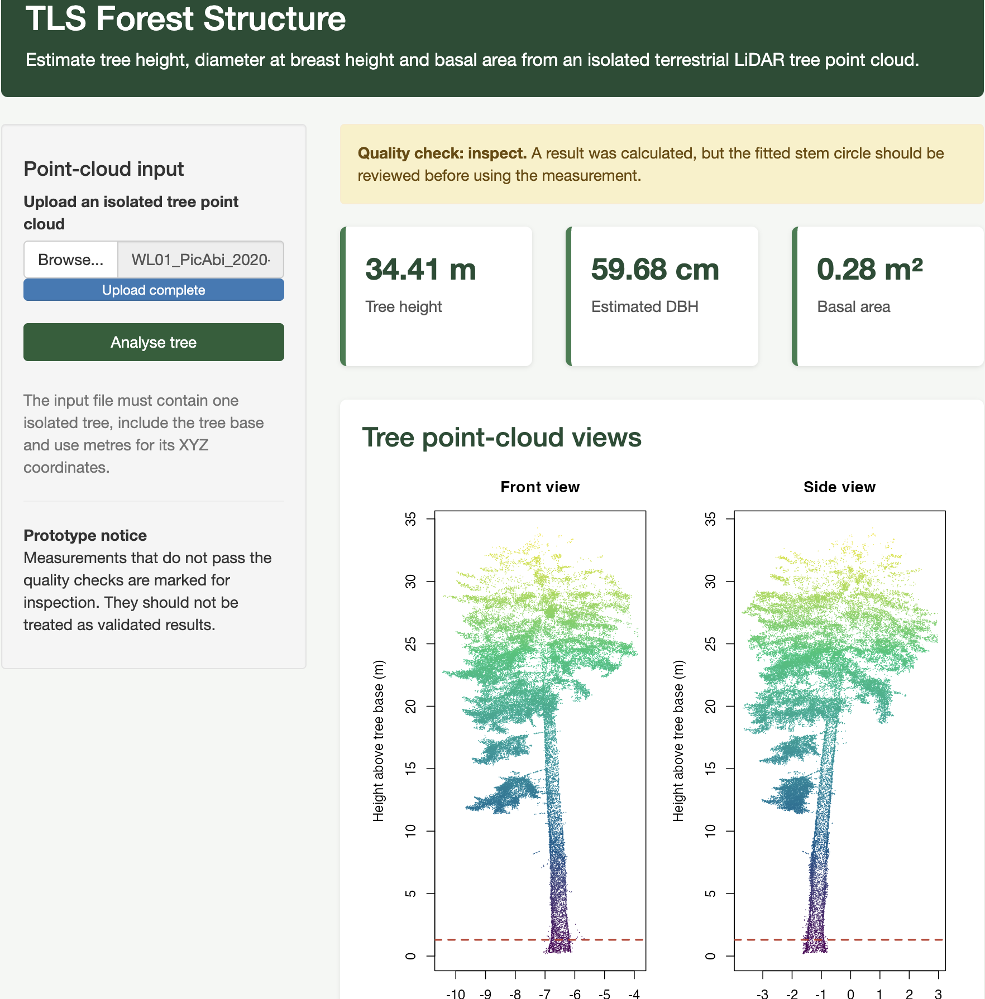

# Open LiDAR Forest Structure

Open-source R workflows for extracting forest and tree structure from airborne and terrestrial LiDAR point clouds.

## About the project

This repository contains two complementary LiDAR workflows:

| Module | Purpose | Documentation |
|---|---|---|
| Airborne LiDAR | Maps canopy structure, detects treetops and delineates crowns across a forest area | [Airborne workflow](docs/airborne_workflow.md) |
| Terrestrial LiDAR | Measures height, DBH, basal area, taper and lower-stem structure from individual-tree point clouds | [TLS workflow](docs/tls_workflow.md) |

The project combines reproducible analysis scripts, processed outputs, validation results and an interactive TLS application.

## Example outputs

### Airborne LiDAR


### Terrestrial LiDAR



Additional figures, tables and spatial files are available in the [outputs directory](outputs/README.md).

## Interactive TLS prototype

The local Shiny application allows a user to upload an isolated-tree `.las` or `.laz` point cloud and calculate:

- tree height;
- diameter at breast height;
- basal area;
- circle-fitting diagnostics;
- an `acceptable`, `inspect` or `failed` quality classification.

It also displays front and side point-cloud views, the 1.3 m cross-section and the fitted DBH circle.

Launch the application from the project root:

```r
shiny::runApp("app")
```

See the [terrestrial LiDAR workflow](docs/tls_workflow.md) for input requirements, validation results and limitations.

## Repository structure

```text
open-lidar-forest-structure/
├── app/
│   └── app.R
├── R/
│   └── tls_processing.R
├── data/
│   ├── raw/
│   │   ├── airborne/
│   │   └── tls/
│   ├── processed/
│   └── reference/
├── scripts/
│   ├── 00_setup.R
│   ├── airborne/
│   └── tls/
├── outputs/
│   ├── airborne/
│   │   ├── figures/
│   │   ├── tables/
│   │   ├── vectors/
│   │   ├── rasters/
│   │   └── models/
│   └── tls/
│       ├── figures/
│       ├── tables/
│       ├── vectors/
│       ├── rasters/
│       └── models/
└── docs/
    ├── airborne_workflow.md
    └── tls_workflow.md
```

## Getting started

Clone the repository and open the RStudio project.

Install the required R packages:

```r
source("scripts/00_setup.R")
```

Run all scripts from the project root.

### Airborne module

```r
source("scripts/airborne/01_inspect_point_cloud.R")
```

Continue with the remaining scripts in `scripts/airborne/` in numerical order.

### TLS module

```r
source("scripts/tls/01_inspect_tls_tree.R")
```

Continue with the remaining scripts in `scripts/tls/` in numerical order.

Instructions for the analysis scripts are provided in:

- [Airborne scripts](scripts/airborne/README.md)
- [TLS scripts](scripts/tls/README.md)

## Data

The airborne example uses `Megaplot.laz`, distributed with the R package `lidR`.

The terrestrial workflow uses open individual-tree TLS point clouds from:

> Bornand, A. (2023). *Individual tree TLS point clouds for tree volume estimation*. EnviDat.
> [https://doi.org/10.16904/envidat.403](https://doi.org/10.16904/envidat.403)

Large raw point clouds and generated raster files are excluded from GitHub. The module documentation explains how the data are organised and processed.

## Current results

The airborne module demonstrates canopy-height modelling, treetop detection, crown delineation and the extraction of biomass-relevant structural predictors.

The TLS module processed tree height successfully for all 59 available trees. DBH estimates were produced for 53 trees, of which 38 passed automatic quality control. Among the quality-approved measurements, mean absolute DBH error was 0.52 cm and root mean square error was 0.78 cm.

These results represent validation on the development dataset rather than independent external validation. Measurements marked `inspect` require visual review, while failed measurements should not be assigned a DBH value.

The airborne biomass layers are structural predictors rather than direct biomass estimates. Biomass estimation requires suitable reference observations and independent model validation.

## Licence

This project is available under the MIT License.