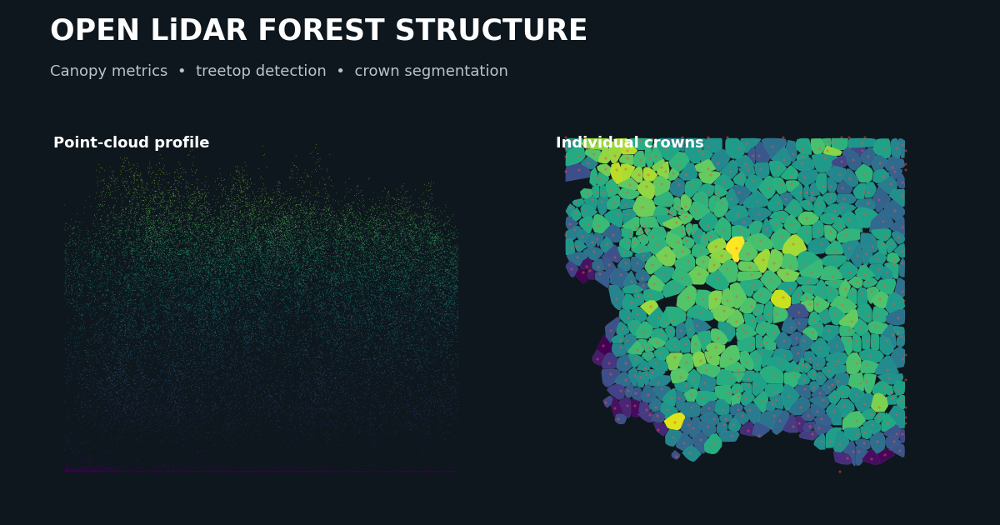
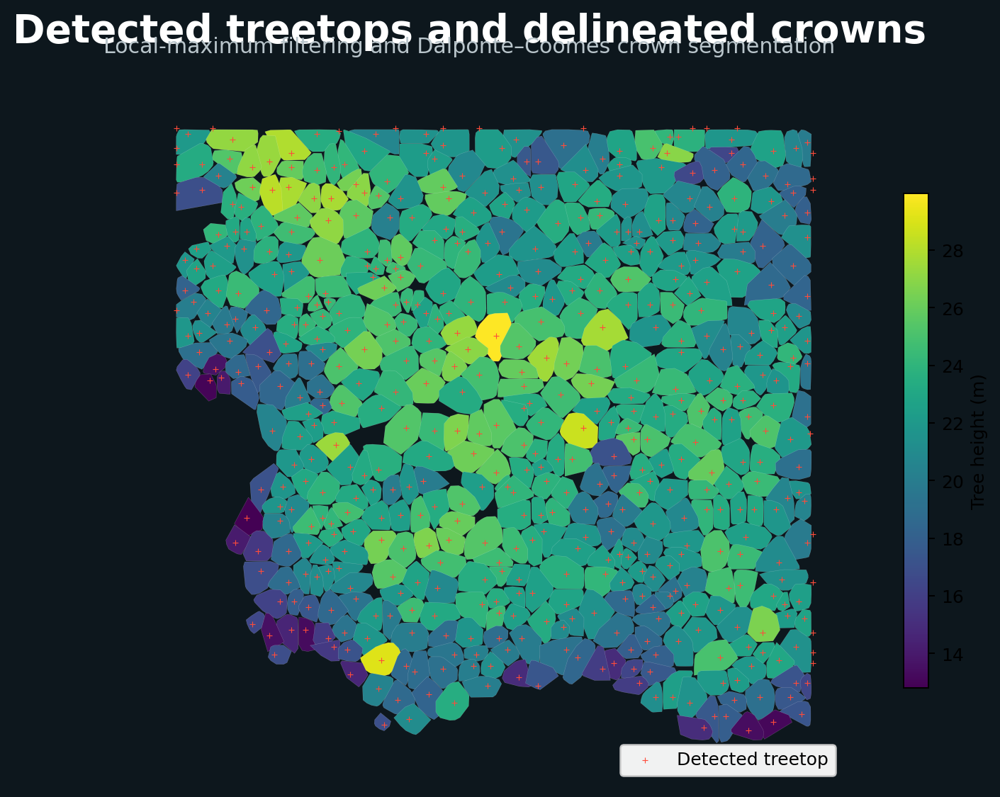

# Open LiDAR Forest Structure

Open-source R workflows for extracting forest and tree structure from airborne and terrestrial LiDAR point clouds.



## About the project

This repository brings two complementary LiDAR workflows into one organised project:

| Module | Purpose | Documentation |
|---|---|---|
| Airborne LiDAR | Maps canopy structure, detects treetops and delineates crowns across a forest area | [Airborne workflow](docs/airborne_workflow.md) |
| Terrestrial LiDAR | Measures DBH, height, taper and lower-stem structure from individual-tree point clouds | [TLS workflow](docs/tls_workflow.md) |

The project currently serves as a documented and reproducible prototype. The longer-term aim is to develop a tool that can process multiple tree point clouds automatically.

## Example outputs

### Airborne LiDAR



### Terrestrial LiDAR


Additional figures, tables and spatial files are available in the [outputs directory](outputs/README.md).

## Repository structure

```text
open-lidar-forest-structure/
├── data/
│   ├── raw/
│   │   ├── airborne/
│   │   └── tls/
│   ├── processed/
│   └── reference/
├── scripts/
│   ├── 00_setup.R
│   ├── airborne/
│   └── tls/
├── outputs/
│   ├── airborne/
│   │   ├── figures/
│   │   ├── tables/
│   │   ├── vectors/
│   │   ├── rasters/
│   │   └── models/
│   └── tls/
│       ├── figures/
│       ├── tables/
│       ├── vectors/
│       ├── rasters/
│       └── models/
└── docs/
    ├── airborne_workflow.md
    └── tls_workflow.md
```

## Getting started

Clone the repository and open the RStudio project.

Install the required R packages:

```r
source("scripts/00_setup.R")
```

The numbered scripts should be run from the project root.

### Airborne module

```r
source("scripts/airborne/01_inspect_point_cloud.R")
```

Continue with the remaining scripts in `scripts/airborne/` in numerical order.

### TLS module

```r
source("scripts/tls/01_inspect_tls_tree.R")
```

Continue with the remaining scripts in `scripts/tls/` in numerical order.

Instructions for each script are provided in:

- [Airborne scripts](scripts/airborne/README.md)
- [TLS scripts](scripts/tls/README.md)

## Data

The airborne example uses `Megaplot.laz`, distributed with the R package `lidR`.

The terrestrial example uses an individual-tree point cloud from:

> Bornand, A. (2023). *Individual tree TLS point clouds for tree volume estimation*. EnviDat.
> https://doi.org/10.16904/envidat.403

Large raw point clouds and generated raster files are excluded from GitHub. See the module documentation for data preparation and processing details.

## Project status

The airborne workflow is complete as a demonstration of canopy and crown-structure extraction.

The TLS workflow is currently a validated single-tree prototype. The next stage is batch processing and evaluation across trees of different species and sizes.

The outputs should be treated as structural measurements and experimental results. Biomass estimation requires suitable reference observations and independent model validation.

## Licence

This project is available under the MIT License.