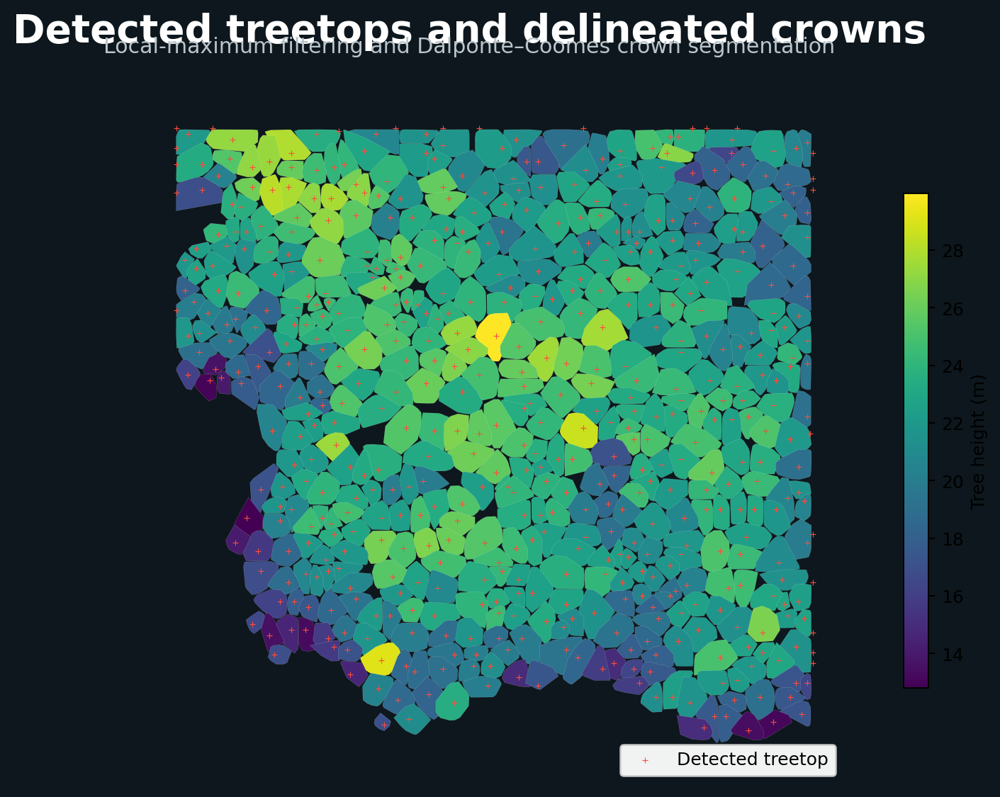
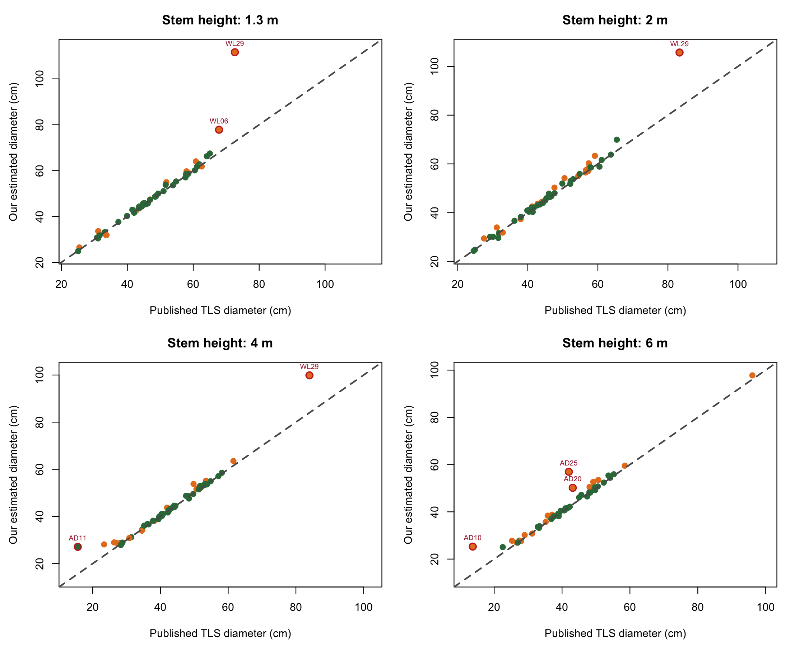

# Open LiDAR Forest Structure

Open-source R workflows for extracting forest and tree structure from airborne and terrestrial LiDAR point clouds.

## About the project

This repository contains two complementary LiDAR workflows:

| Module | Purpose | Documentation |
| --- | --- | --- |
| Airborne LiDAR | Maps canopy structure, detects treetops and delineates crowns across a forest area | [Airborne workflow](docs/airborne_workflow.md) |
| Terrestrial LiDAR | Measures height, DBH, basal area, taper and lower-stem structure from individual-tree point clouds | [TLS workflow](docs/tls_workflow.md) |

The project combines reproducible analysis scripts, processed outputs, validation results and an interactive TLS application.

## Example outputs

### Airborne LiDAR



### Terrestrial LiDAR



Additional figures, tables and spatial files are available in the [outputs directory](outputs/README.md).

## Interactive TLS Tree Structure Analyser

The local Shiny application processes isolated-tree `.las` or `.laz` point clouds and reports:

- tree height;
- diameter at breast height;
- basal area;
- stem diameters at 2, 4 and 6 m;
- lower-stem taper, displacement and lean;
- preferred crown diameter;
- alternative crown-width measurements;
- maximum crown span;
- experimental projected convex-hull area;
- circle-fitting and geometric quality diagnostics;
- an `acceptable`, `inspect` or `failed` quality classification.

The application supports both single-tree and batch processing. Individual processed trees can be selected for visual inspection of the point cloud, fitted DBH circle, lower-stem taper and projected crown hull.

Launch the application from the project root:

```r
shiny::runApp("app")

## Repository structure

```text
open-lidar-forest-structure/
├── app/
│   └── app.R
├── R/
│   └── tls_processing.R
├── data/
│   ├── raw/
│   │   ├── airborne/
│   │   └── tls/
│   ├── processed/
│   └── reference/
├── scripts/
│   ├── 00_setup.R
│   ├── airborne/
│   └── tls/
├── outputs/
│   ├── airborne/
│   │   ├── figures/
│   │   ├── tables/
│   │   ├── vectors/
│   │   ├── rasters/
│   │   └── models/
│   └── tls/
│       ├── figures/
│       ├── tables/
│       ├── vectors/
│       ├── rasters/
│       └── models/
└── docs/
    ├── airborne_workflow.md
    └── tls_workflow.md
```

## Getting started

Clone the repository and open the RStudio project. Install the required R packages:

```r
source("scripts/00_setup.R")
```

Run scripts from the project root and follow the numerical order within each module:

```r
# Airborne LiDAR
source("scripts/airborne/01_inspect_point_cloud.R")

# Terrestrial LiDAR
source("scripts/tls/01_inspect_tls_tree.R")
```

Detailed script instructions are provided in:

- [Airborne scripts](scripts/airborne/README.md)
- [TLS scripts](scripts/tls/README.md)

## Data

The airborne example uses `Megaplot.laz`, distributed with the R package `lidR`.

The terrestrial workflow uses open individual-tree TLS point clouds from:

> Bornand, A. (2023). *Individual tree TLS point clouds for tree volume estimation*. EnviDat.
> <https://doi.org/10.16904/envidat.403>

Large raw point clouds and generated raster files are excluded from GitHub. The module documentation explains how the data are organised and processed.

## Current results

The airborne module demonstrates canopy-height modelling, treetop detection, crown delineation and extraction of biomass-relevant structural predictors.

The TLS module calculated height for all 59 trees and DBH for 53 trees. Thirty-eight DBH estimates passed automatic quality control; within that group, mean absolute difference from the published TLS-derived DBH was 0.52 cm and root mean square difference was 0.78 cm.

Stem diameters were also estimated at 1.3, 2, 4 and 6 m. Among measurements passing geometric quality control, mean absolute differences from the published TLS-derived values ranged from 0.50 to 0.72 cm across the four heights. Eight comparisons differed by at least 5 cm and were placed in a separate investigation queue.

Crown width was estimated from the complete horizontal projection of each segmented tree. The preferred convex-hull-derived crown diameter was calculated successfully for all 59 trees. Compared with the published second crown-diameter variable, it had a mean absolute difference of 0.181 m and a root mean square difference of 0.241 m; all 59 estimates were within 1 m. Projected convex-hull area is reported separately as an experimental structural metric because it did not reproduce the published crown-area definition.

These comparisons use measurements derived from the same TLS dataset and are not independent field validation. Results marked `inspect` require visual review, while failed measurements are not assigned a diameter.

The airborne biomass layers are structural predictors rather than direct biomass estimates. Biomass estimation requires suitable reference observations and independent model validation.

## Licence

This project is available under the MIT License.
