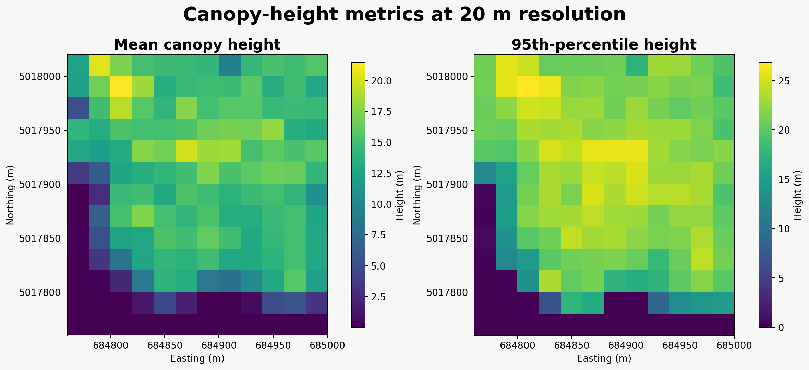
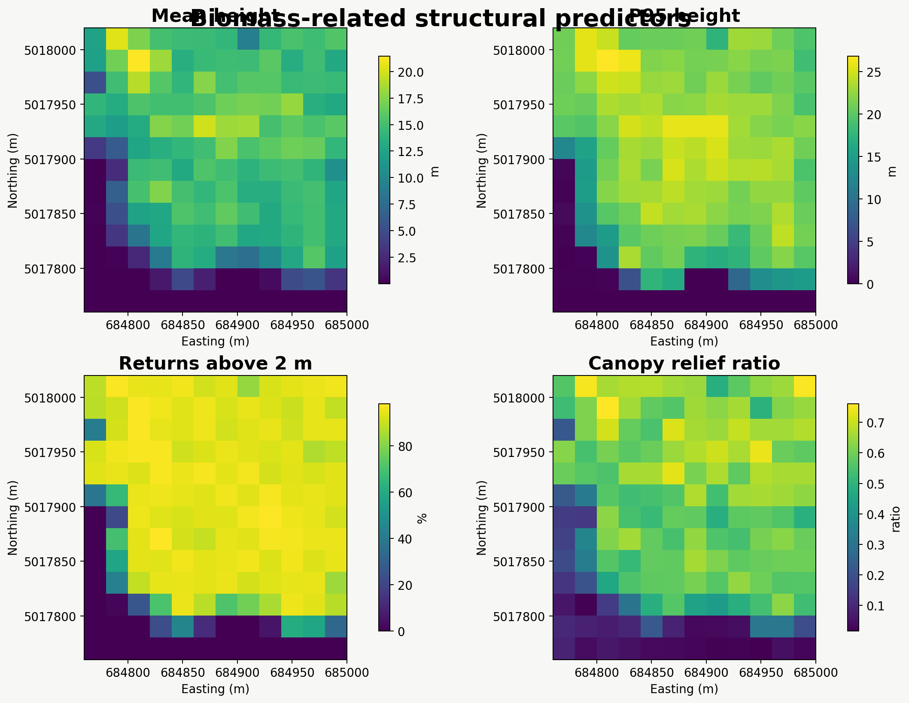
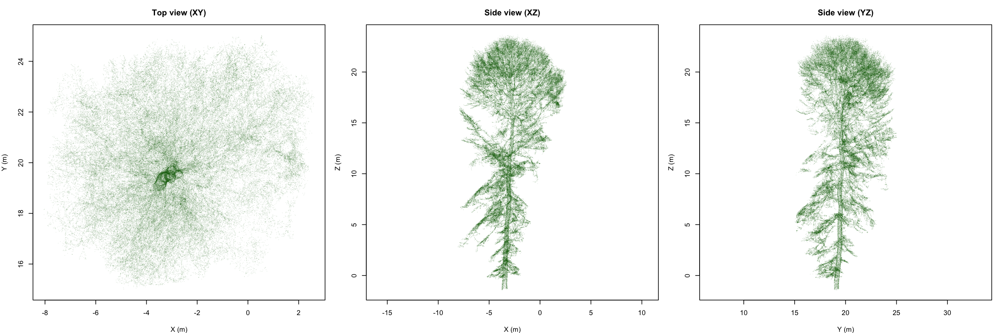
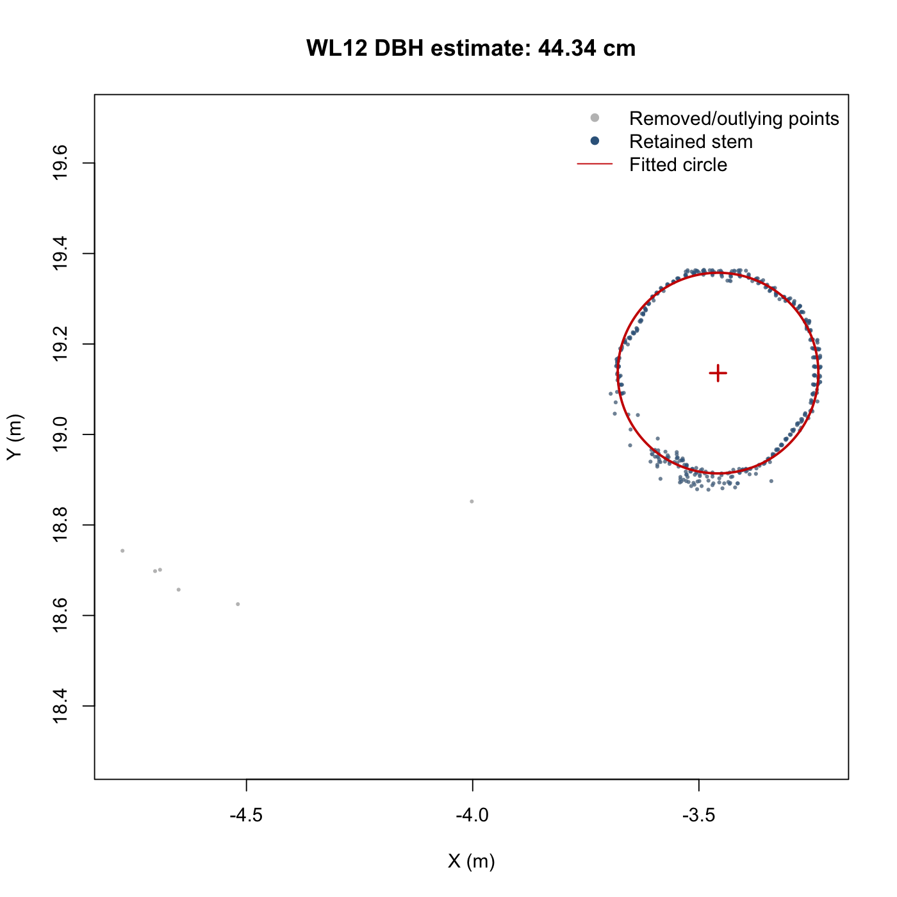
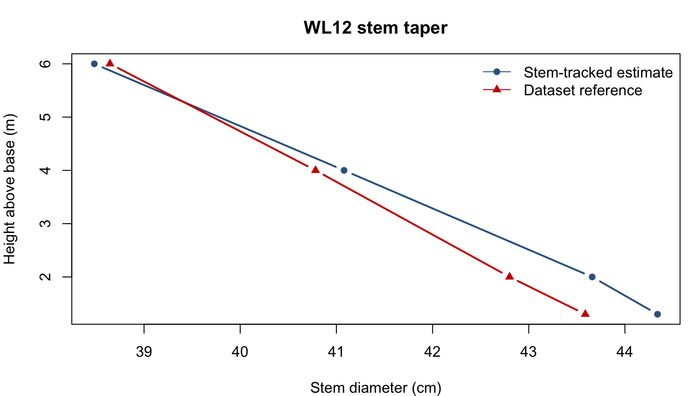

# Outputs

Results are organised by LiDAR platform and then by output type.

## Airborne LiDAR

The airborne workflow produces landscape- and individual-crown structural information.

| Folder | Contents |
|---|---|
| `airborne/figures/` | Point-cloud, canopy-metric, treetop, crown and structural-predictor figures |
| `airborne/tables/` | Site metrics, crown measurements, treetop sensitivity and 20 m predictor values |
| `airborne/vectors/` | Detected treetops and delineated crown polygons |
| `airborne/rasters/` | Canopy height and 20 m structural-metric rasters |
| `airborne/models/` | Reserved for future calibrated biomass models |

### Selected figures

## Terrestrial LiDAR

The TLS workflow produces individual-tree and lower-stem measurements for the `WL12` demonstration tree.

| Folder | Contents |
|---|---|
| `tls/figures/` | TLS projections, DBH fitting, stem taper and lower-stem visualisations |
| `tls/tables/` | DBH, taper, tracked stem-centre and structural-summary results |
| `tls/vectors/` | Reserved for future spatial tree outputs |
| `tls/rasters/` | Reserved for future rasterised TLS products |
| `tls/models/` | Reserved for fitted stem and QSM model objects |

### Selected figures

## Reproducibility note

Large raw point clouds, generated rasters and model objects are excluded from GitHub where appropriate. They can be recreated locally by following the numbered scripts in `scripts/airborne/` and `scripts/tls/`.